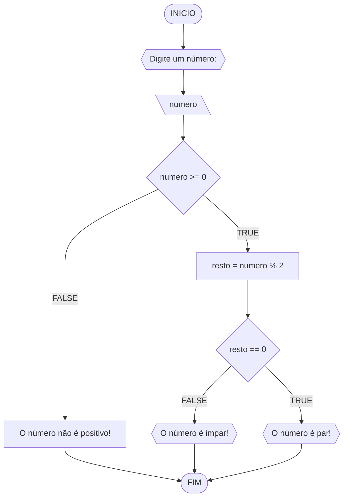
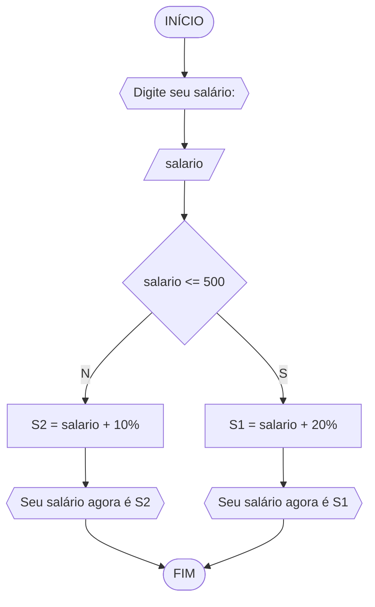
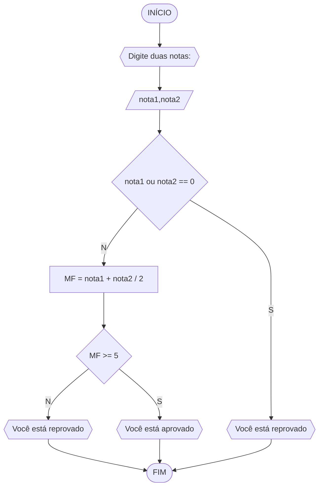
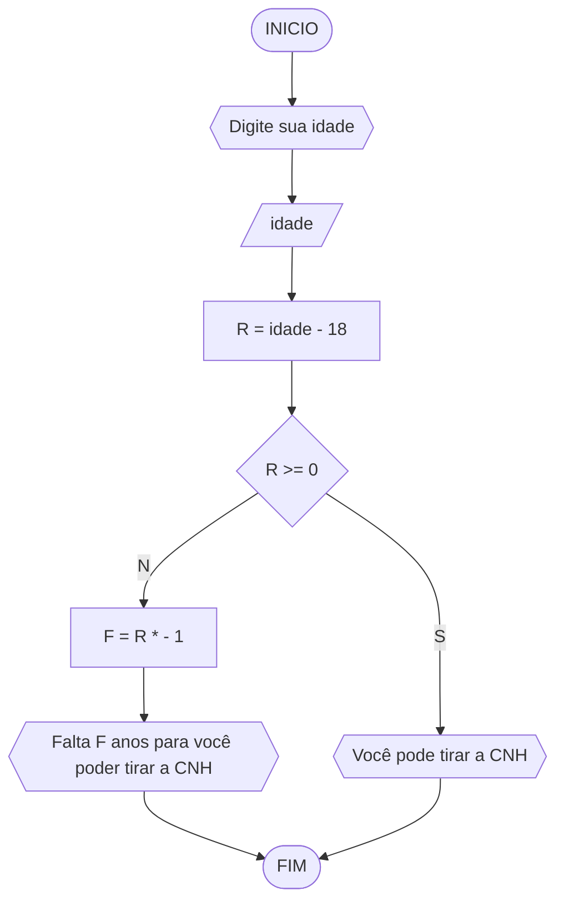

# UNIFOR
**Nome**: Nome do estudante <br>
**Disciplina**: Raciocínio lógico algorítmico

## Lista de exercícios 01

### Exercício 01 (1 ponto)
Represente, em fluxograma e pseudocódigo, um algoritmo para determinar se um número inteiro e positivo é par ou impar.

#### Fluxograma (0,25 ponto)


#### Pseudocódigo (0,5 ponto)
```
1  ALGORTIMO verifica_par_impar
2  DECLARE numero, resto: INTEIRO
3  ESCREVA "Digite um número: "
4  INICIO
4  LEIA numero
5  SE numero >= 0 ENTAO                  // verifica se o inteiro é positivo
6    resto = numero % 2                 // calcula o resto da divisão por 2
7    SE resto == 0 ENTAO                // verifica se o resto é igual a zero
8      ESCREVA "O número é par!"
9    SENAO
10     ESCREVA "O número é impar!"
11   FIM_SE
11  SENAO                                // caso inteiro for negativo (condição linha 5)
12    ESCREVA "O número deve ser postivo!"
13  FIM_SE
13 FIM
```

#### Teste de mesa (0,25 ponto)
| numero | numero >= 0 | resto | resto == 0 | Saída |
| -- | -- | -- | -- | -- | 
| -1 | F |   |   | "O número deve ser postivo!" |
| 0  | V | 0 | V | "O número é par!" |
| 13 | V | 1 | F | "O número é impar!" |
| 30 | V | 0 | V | "O número é par!" |

## Exercício 02 (3 pontos)
Represente, em fluxograma e pseudocódigo, um algoritmo para calcular o novo salário de um funcionário. 
Sabe-se que os funcionários que recebem atualmente salário de até R$ 500 terão aumento de 20%; os demais terão aumento de 10%.

#### Fluxograma (1.0 ponto)


#### Pseudocódigo (1.0 ponto)
```
ALGORITMO novo_salario
DECLARE salario,S1 E S2 :POSITIVO
ESCREVA "Digite seu salário"
LEIA salario
SE salario <= 500 ENTAO
	S1 = salario + 20%
	ESCREVA "Seu salário agora é S1"
SENAO
	S2 = salario + 10%
	ESCREVA "Seu salário agora é S2"
FIM_SE
FIM_ALGORITMO
```

#### Teste de mesa (1.0 ponto)

| salario | salario <= 500 | salario*1.2 | salario*1.1 | Saída | 
| -- | -- | -- | -- | -- | 
| 450 | S | 450*1.2 |    | Seu salario agora é S1 |
| 600 | N |    | 600*1.1 | Seu salario agora é S2 |

## Exercício 03 (3 pontos)
Represente, em fluxograma e pseudocódigo, um algoritmo para calcular a média aritmética entre duas notas de um aluno e mostrar sua situação, que pode ser aprovado ou reprovado.

#### Fluxograma (1 ponto)


#### Pseudocódigo (1 ponto)
```
ALGORITMO aprovado_reprovado
DECLARE nota1,nota2 e R :POSITIVO
ESCREVA "Digite dois números"
LEIA N1,N2
SE nota1 OU nota2 == 0 ENTAO
	ESCREVA "Você está reprovado"
SENAO
	MF = nota1 + nota2 / 2
	SE MF >= 5 
		ESCREVA "Você está reprovado"
	SENAO
		ESCREVA "Você está reprovado"
	FIM_SE
FIM_SE
FIM_ALGORITMO
```
#### Teste de mesa (1.0 ponto)
| nota1 | nota2 | nota1 ou nota2 == 0 | MF = nota1 + nota2 / 2 | Saída | 
| -- | -- | -- | -- | -- | 
| 5 | 7 | N | MF = 5 + 7 / 2 | Aprovado! |
| 5 | 0 | S |   | Reprovado!  |
| 0 | 7 | S |   | Reprovado!  |


## Exercício 04 (3 pontos)
Represente, em fluxograma e pseudocódigo, um algoritmo que, a partir da idade do candidato(a), determinar se pode ou não tirar a CNH. 
Caso não atender a restrição de idade, calcular quantos anos faltam para o candidato estar apto.

#### Fluxograma (1.0 ponto)


#### Pseudocódigo (1.0 ponto)
```
ALGORITMO pode_tirar_cnh
DECLARE N1,R e F INTEIRO
LEIA N1
R = N1 - 18
SE R >= 0 ENTAO
	ESCREVA "Você pode tirar a CNH"
SENAO
	P = R * -1
	ESCREVA "Falta F anos para voê poder tirar a CNH"
FIM_SE
FIM_ALGORITMO
```

#### Teste de mesa (1.0 ponto)
| idade | R = idade - 18 | R >= 0 | F = R + 18 * -1 | Saída | 
| -- | -- | -- | -- | -- | 
| 19 | 1 | S |   | Você pode tirar a CNH! |
| 15 | -3 | N | F = - 3 * - 1| Faltam 3 anos para você poder tirar a CNH! |
| 18 | 0 | S |   | Você pode tirar a CNH! |
