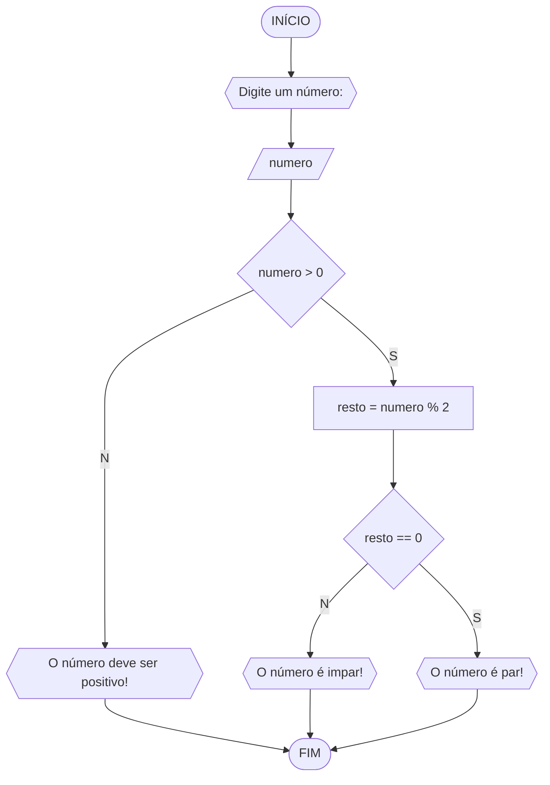

# UNIFOR
**Disciplina:** Raciocínio Lógico Algorítmico 
**Orientador:** Prof. Ricardo Carubbi

## Lista 1 de Exercícios

### Exercício 3
Represente, em fluxograma e pseudocódigo, um algoritmo para determinar se um número inteiro e positivo é par ou impar.

#### Fluxograma




```
ALGORITMO verifica_par_impar
DECLARE numero,resto INTEIRO
ESCREVA "Digite um número"
LEIA número
SE numero > 0 ENTAO
	resto = numero % 2
	SE resto == 0 ENTAO
		ESCREVA "O número é par!"
	SENAO
		ESCREVA"O número é impar!"
SENAO
	ESCREVA"O número deve ser positivo"
FIM_ALGORITMO
```
