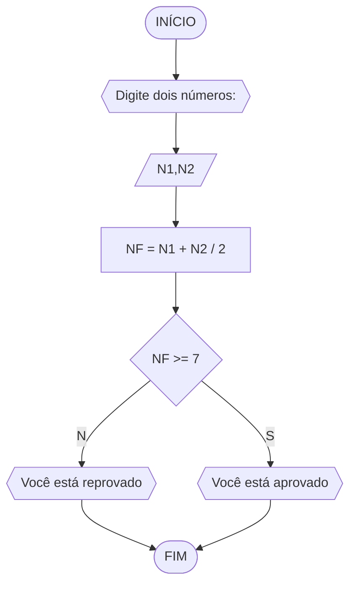
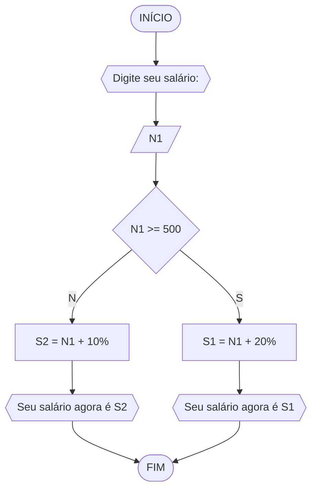
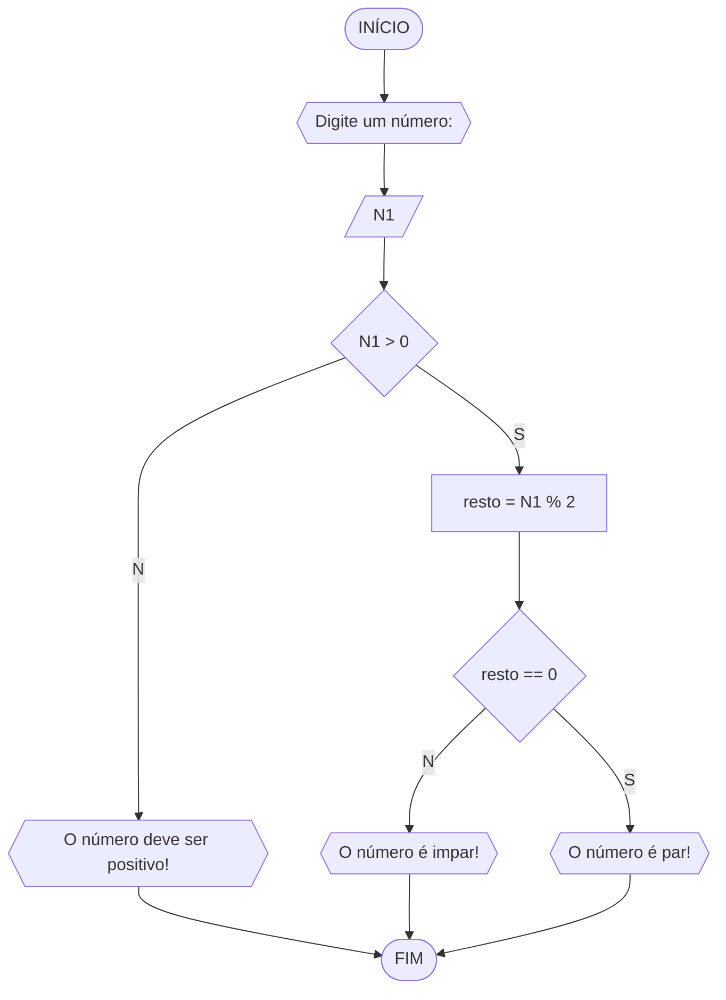
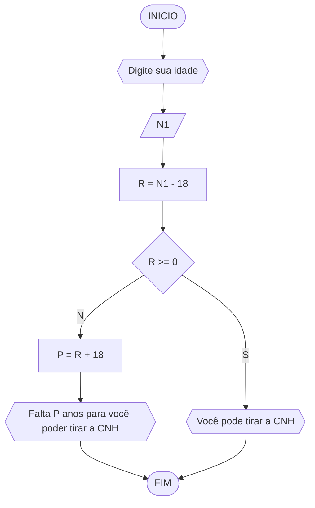

# UNIFOR
**Disciplina:** Raciocínio Lógico Algorítmico 
**Orientador:** Prof. Ricardo Carubbi

## Lista 1 de Exercícios
### Exercício 1
Represente, em fluxograma e pseudocódigo, um **algoritmo para calcular a média aritmética entre duas notas de um aluno e mostrar sua situação, que pode ser aprovado ou reprovado.**
#### Fluxograma

#### Pseudocódigo
```
ALGORITMO aprovado_reprovado
DECLARE N1,N2 e NF POSITIVO
ESCREVA "Digite dois números"
LEIA N1,N2
NF = N1 + N2 / 2
SE NF >= 7 ENTAO
	ESCREVA "Você está aprovado"
SENAO
	ESCREVA "Você está reprovado"
FIM_ALGORITMO
```
### Exercício 2
Represente, em fluxograma e pseudocódigo, um **algoritmo para calcular o novo salário de um funcionário. Sabe-se que os funcionários que recebem atualmente salário de até R$ 500 terão aumento de 20%; os demais terão aumento de 10%.**
#### Fluxograma

#### Pseudocódigo
```
ALGORITMO novo_salario
DECLARE N1,S1 E S2 POSITIVO
ESCREVA "Digite seu salário"
LEIA N1
SE N1 >= 500 ENTAO
	S1 = N1 + 20%
	ESCREVA "Seu salário agora é S1"
SENAO
	S2 = N1 + 10%
	ESCREVA "Seu salário agora é S2"
FIM_ALGORITMO
```
### Exercício 3
Represente, em fluxograma e pseudocódigo, um **algoritmo para determinar se um número inteiro e positivo é par ou impar.**

#### Fluxograma



#### Pseudocódigo
```
ALGORITMO verifica_par_impar
DECLARE N1,resto INTEIRO
ESCREVA "Digite um número"
LEIA N1
SE N1 > 0 ENTAO
	resto = N1 % 2
	SE resto == 0 ENTAO
		ESCREVA "O número é par!"
	SENAO
		ESCREVA"O número é impar!"
SENAO
	ESCREVA"O número deve ser positivo"
FIM_ALGORITMO
```
### Exercício 4
Represente, em fluxograma e pseudocódigo, um **algoritmo que, a partir da idade do candidato(a), determinar se pode ou não tirar a CNH. Caso não atender a restrição de idade, calcular quantos anos faltam para o candidato estar apto.**
#### Fluxograma

#### Pseudocódigo
```
ALGORITMO pode_tirar_cnh
DECLARE N1,R e P INTEIRO
LEIA N1
R = N1 - 18
SE R >= 0 ENTAO
	ESCREVA "Você pode tirar a CNH"
SENAO
	P = R + 18
	ESCREVA "Falta P anos para voê poder tirar a CNH"
FIM_ALGORITMO
```
