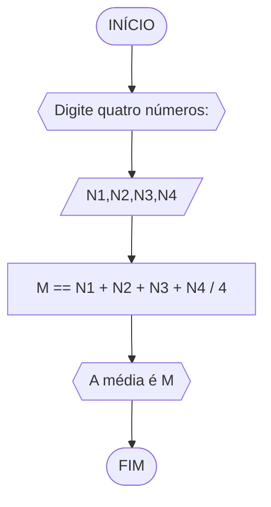
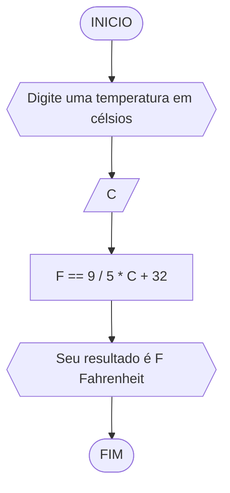
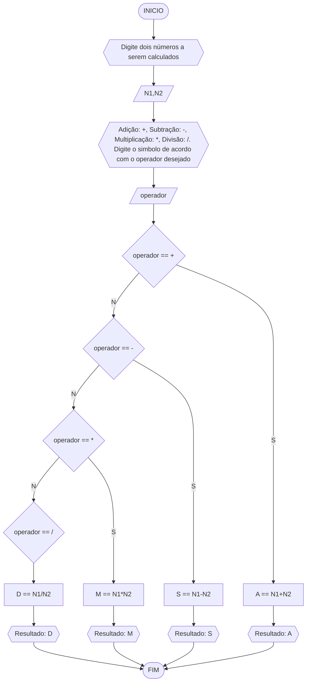
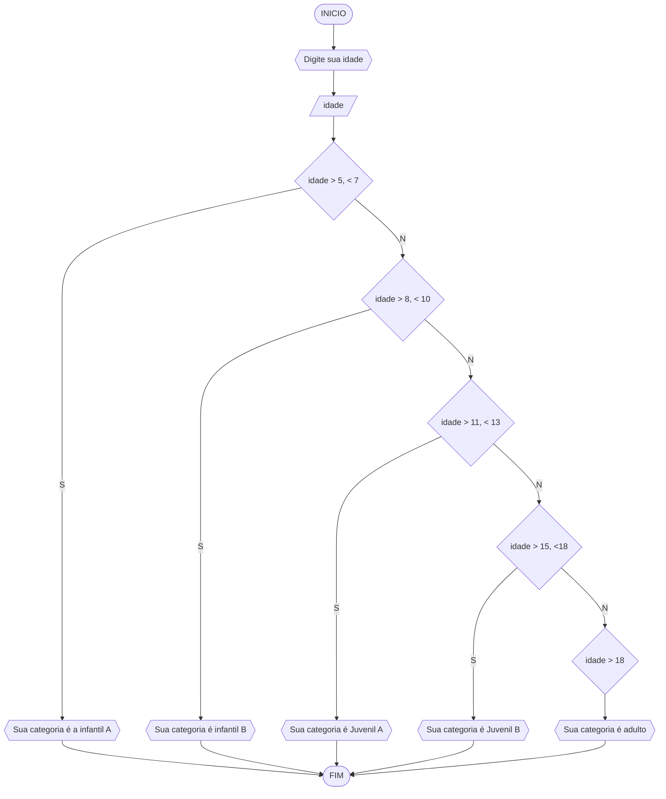

# UNIFOR
**Nome**: Lucas Gabriel Brigagão <br>
**Disciplina**: Raciocínio lógico algorítmo

### Exercício 01 (2.5 pontos)
Calcule a média de quatro números inteiros dados.

#### Fluxograma (1.0 ponto)


#### Pseudocódigo (1.0 ponto)
```
ALGORITMO calc_média
DECLARE N1,N2,N3,N4,M: INTEIRO
ESCREVA " Digite quatro números"
LEIA N1,N2,N3,N4
M == N1 + N2 + N3 + N4 / 4
ESCREVA "A média é M"
FIM_ALGORITMO
```

#### Teste de mesa (0.5 ponto)
| N1 | N2 | N3 | N4 | M = N1 + N2 + N3 + N4 / 4 | Saída
| -- | -- | -- | -- | -- | -- |
| 1 | 3 | 5 | 7 | M = 1 + 3 + 5 + 7 / 4| Sua média é 4
| 2 | 4 | 6 | 8 | M = 2 + 4 + 6 + 8 / 4| Sua média é 5

### Exercício 02 (2.5 pontos)
Leia uma temperatura dada em Celsius (C) e imprima o equivalente em Fahrenheit (F). (Fórmula de conversão: F = (9/5) * C + 32)

#### Fluxograma (1.0 ponto)


#### Pseudocódigo (1.0 ponto)
```
ALGORITMO calc_fahrenheit
DECLARE C,F
LEIA C
F == 5/9*N1+32
ESCREVA "Seu resuldado é F Fahrenheit"
FIM_ALGORITMO
```

#### Teste de mesa (0.5 ponto)
| C | F == 9 / 5 * C + 32 | Saída
| -- | -- | -- |
| 45 | F = 9 / 5 * 45 + 32 | Essa temperatura em fahrenheit é 113
| 38 | F = 9 / 5 * 45 + 38 | Essa temperatura em fahrenheit é 100,4

### Exercício 03 (2.5 pontos)
Receba dois números reais e um operador e efetue a operação correspondente com os valores recebidos (operandos). 
O algoritmo deve retornar o resultado da operação selecionada simulando todas as operações de uma calculadora simples.

#### Fluxograma (1.0 ponto)


#### Pseudocódigo (1.0 ponto)
```
ALGORITMO_calculadora
DECLARE N1,N2,operador,A,S,M,D
ESCREVA "Digite dois números a serem calculados"
LEIA N1,N2
ESCREVA "Adição: +, Subtração: -, Multiplicação: *, Divisão: /. Digite o simbolo de acordo com o operador desejado"
LEIA operador
SE operador == +
ENTAO
	A == N1+N2
	ESCREVA "Resultado: A"
SENAO
	SE operador == -
	ENTAO
		S == N1+N2
		ESCREVA "Resultado: S"
	SENAO
		SE operador == *
		ENTAO
			M == N1*N2
			ESCREVA "Resultado: M"
		SENAO
			SE operador == /
			D == N1/N2
			ESCREVA "Resultado: D"
FIM_ALGORITMO
```

#### Teste de mesa (0.5 ponto)
| N1 | N2 | operador | A = N1 + N2 | S = N1 - N2 | M = N1 * N2 | D = N1 / N2 | Saída 
| -- | -- | -- | -- | -- | -- | -- | -- |
| 1 | 2 | + | A = 1 + 2 |   |   |   | A = 3
| 3 | 4 | - |   | S = 3 - 4 |   |   | S = -1
| 5 | 6 | * |   |   | M = 5 * 6 |   | M = 30
| 7 | 8 | / |   |   |   | D = 7 / 8  | D = 0.875

### Exercício 04 (2.5 pontos)
Elaborar um algoritmo que, dada a idade, classifique nas categorias: infantil A (5 - 7 anos), infantil B (8 -10 anos), juvenil A (11 - 13 anos), juvenil B (14 -17 anos) e adulto (maiores que 18 anos).

#### Fluxograma (1.0 ponto)


#### Pseudocódigo (1.0 ponto)
```
ALGORITMO_categoria
Declare idade
LEIA idade
SE idade >= 5, <= 7
ENTAO
	ESCREVA "Sua categoria é infantil A"
SENAO
	SE idade >= 8, <= 10
	ENTAO
		ESCREVA "Sua categoria é infantil B"
	SENAO
		SE idade >= 11, <= 13
		ENTAO
			ESCREVA "Sua categoria é juvenil A"
		SENAO
			SE idade >= 14, <= 17
			ENTAO
				ESCREVA "Sua categoria é juvenil B"
			SENAO
				SE idade > 18
				ESCREVA "Sua categoria é adulta"
FIM_ALGORITMO
```

#### Teste de mesa (0.5 ponto)
| idade | idade >= 5, <= 7 | idade >= 8, <= 10 | idade >= 11, <= 13 | idade >= 14, <= 17 | idade >= 18 |  Saída 
| -- | -- | -- | -- | -- | -- | -- | 
| 6 | S | N | N | N | N | Sua categoria é infantil A
| 9 | N | S | N | N | N | Sua categoria é infantil B
| 12 | N | N | S | N | N | Sua categoria é juvenil A
| 15 | N | N | N | S | N | Sua categoria é juvenil B
| 18 | N | N | N | N | S | Sua categoria é adulta
