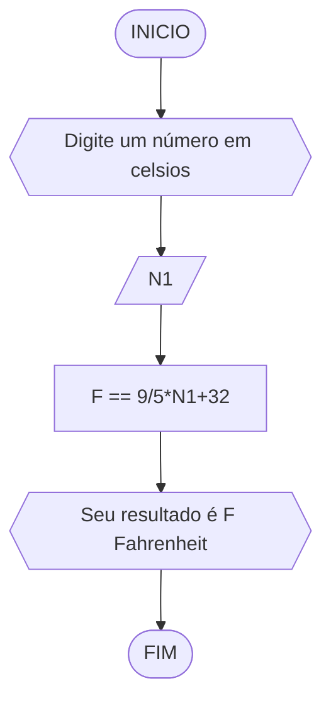

# UNIFOR
**Disciplina:** Raciocínio Lógico Algorítmico 
**Orientador:** Prof. Ricardo Carubbi

## Lista 2 de Exercícios
### Exercício 1
Calcule a média de quatro números inteiros dados.
#### Fluxograma

#### Pseudocódigo 
```
ALGORITMO calc_média
DECLARE N1,N2,N3,N4,M INT
ESCREVA " Digite quatro números"
LEIA N1,N2,N3,N4
M == N1+N2+N3+N4/4
ESCREVA "Seu resultado é M"
FIM_ALGORITMO
```
### Exercício 2
Leia uma temperatura dada na escala Celsius (C) e imprima o equivalente em Fahrenheit (F). (Fórmula de conversão: F = (9/5) * C + 32)

#### Pseudocódigo
```mermaid
flowchart TD
ALGORITMO calc_temperatura
DECLARE N1,F 
LEIA N1
F == 5/9*N1+32
ESCREVA "Seu resuldado é F Fahrenheit"
FIM_ALGORITMO
```
### Exercício 3
Leia uma quantidade de chuva dada em polegadas e imprima o equivalente em milímetros (25,4 mm = 1 polegada).

#### Pseudocódigo
```
ALGORITMO calc_mm
DECLARE N1,MM
LEIA N1
MM == N1*25.4
ESCREVA "Seu resultado é MM milímetros"
FIM_ALGORITMO
```
### Exercício 4
O custo ao consumidor de um carro novo é a soma do custo de fábrica com a porcentagem do distribuidor e dos impostos, ambos aplicados ao custo de fábrica. Supondo que a porcentagem do distribuidor seja de 12% e a dos impostos de 45%, prepare um algoritmo para ler o custo de fábrica do carro e imprimir o custo ao consumidor.
#### Fluxograma

#### Pseudocódigo 
```
ALGORITMO calc_valorfinal
DECLARE N1,VF
ESCREVA "Digite o preço do carro"
LEIA N1
VF == N1*1.12*1.45
ESCREVA "O valor do carro é VF"
FIM_ALGORITMO
```
### Exercício 5
Calcule o quadrado de um número.
#### Fluxograma

#### Pseudocódigo
```
ALGORITMO calc_quadrado
DECLARE N1,V
ESCREVA "Digite um número"
LEIA N1
V == N1**2
ESCREVA "N1 ao quadrado é V"
FIM_ALGORITMO
```
### Exercício 6
O cardápio de uma lanchonete é dado abaixo. Prepare um algoritmo que leia a quantidade de cada item que você consumiu e calcule a conta final.
a) Hambúrguer................ R$ 3,00
b) Cheeseburger.............. R$ 2,50
c) Fritas.................... R$ 2,50
d) Refrigerante ............. R$ 1,00
e) Milkshake................. R$ 3,00
#### Fluxograma
```mermaid
flowchart TD
```
#### Pseudográfico
```
ALGORITMO
FIM_ALGORITMO
```
### Exercício 7
Uma companhia de carros paga a seus empregados um salário de R$ 500,00 por mês mais uma comissão de R$ 50,00 para cada carro vendido e mais 5% do valor da venda. Elabore um algoritmo para calcular e imprimir o salário do vendedor num dado mês recebendo
como dados de entrada o nome do vendedor, o número de carros vendidos e o valor total das vendas.
#### Fluxograma

#### Pseudográfico
```
ALGORITMO_salário]
DECLARE nome,vendas,valor,N1,N2,N3 
ESCREVA "Digite seu nome"
LEIA nome
ESCREVA "digite quantos carros você vendeu"
LEIA vendas
SE vendas > 0
ENTAO
	N1 == vendas*50
	ESCREVA "Digite o valor total das vendas"
	LEIA valor
	N2 == valor*0.05
	N3 == N1+N2+500
	ESCREVA "nome recebeu N3 reais"
SENAO
	ESCREVA "nome recebeu 500 reais"
FIM_ALGORITMO
```
### Exercício 8
Calcule a média de um aluno na disciplina de RLA. Para isso solicite o nome do aluno, a nota da prova e a nota qualitativa. Sabe-se que a nota da prova tem peso 2 e a nota qualitativa peso 1. Mostre a média como resultado.

#### Pseudográfico
```
ALGORITMO_média_f
DECLARE nome,N1,N2,MF
ESCREVA "Digite seu nome"
LEIA nome
ESCREVA "Digite sua nota de prova"
LEIA N1
ESCREVA "Digite sua nota de prova qualitativa"
LEIA N2
MF == N1*2+N2/3
ESCREVA "Sua média é M"
FIM_ALGORITMO
```
### Exercício 9
Suponha que você deseja preencher a seguinte ficha de inscrição de um estudante: nome, matrícula, curso, idade, e-mail. Imprima os dados do usuário como uma ficha preenchida.
#### Fluxograma

#### Pseudográfico
```
ALGORITMO_ficha
DECLARE nome,matricula,curso,idade,email
ESCREVA "Digite seu nome"
LEIA nome
ESCREVA "Digite sua matrícula"
LEIA matricula
ESCREVA "Digite seu curso"
LEIA curso
ESCREVA "Digite sua idade"
LEIA idade
ESCREVA "Digite seu e-mail"
LEIA email
ESCREVA "Nome: nome - Matrícula: matricula - Curso: curso - Idade: idade - E-mail: email"
FIM_ALGORITMO
```
### Exercício 10
Calcule e mostre a área e o perímetro de um círculo. Sabe-se que a área = Ⲡ * raio² e o perímetro = 2 * Ⲡ * raio.
#### Fluxograma

#### Pseudográfico
```
ALGORITMO_raio_perimetro
DECLARE R,area,perimetro
ESCREVA "Digite o raio do círculo"
LEIA R
area == 3.14*R**2
perimetro == 2*3.14*R
ESCREVA "Sua área é area e seu perímetro é perimetro"
FIM_ALGORITMO
```
### Exercício 11
Faça um programa que receba um número positivo e maior que zero, calcule e mostre:
a) o número digitado ao quadrado;
b) o número digitado ao cubo;
c) a raiz quadrada do número digitado;
d) a raiz cúbica do número digitado.
#### Fluxograma

#### Pseudográfico
```
ALGORITMO_calculos
DECLARE N1,NQ,NC,NRQ,NRC 
ESCREVA "Digite um número"
LEIA N1
SE N1 > 0 
ENTAO
	NQ == N1**2
	NC == N1**3
	NRQ == N1**1/2
	NRC == N1**/1*3
	ESCREVA "O número digitado ao quadrado é NQ e ao cubo é 			NC,a raiz quadrada do número digitado é NRQ e a raiz cúbica é 		NRC
SENAO 
	ESCREVA "O número deve ser  positivo!"
FIM_ALGORITMO
```
### Exercício 12
Faça um algoritmo que lê três números inteiros e mostra-os em ordem crescente.
### Fluxograma 
```mermaid
flowchart TD
```
#### Pseudográfico
```
ALGORITMO
FIM_ALGORITMO
```
### Exercício 13
Elaborar um algoritmo que, dada a idade de um nadador, classificá-lo nas categorias:
a) infantil A (5 - 7 anos),
b) infantil B (8 -10 anos),
c) juvenil A (11 - 13 anos),
d) juvenil B (14 -17 anos) e
e) adulto (maiores que 18 anos).
#### Fluxograma

#### Pseudocódigo
```
ALGORITMO_categoria
Declare idade
LEIA idade
SE idade > 5, < 7
ENTAO
	ESCREVA "Sua categoria é infantil A"
SENAO
	SE idade > 8, < 10
	ENTAO
		ESCREVA "Sua categoria é infantil B"
	SENAO
		SE idade > 11, < 13
		ENTAO
			ESCREVA "Sua categoria é juvenil A"
		SENAO
			SE idade > 14, < 17
			ENTAO
				ESCREVA "Sua categoria é juvenil B"
			SENAO
				ESCREVA "Sua categoria é adulta"
FIM_ALGORITMO
```
### Exercício 14
Dado três inteiros crie um algoritmo para retornar o menor deles.
#### Fluxograma

#### Pseudográfico
```
ALGORITMO_menor
DECLARE N1,N2,N3
LEIA N1,N2,N3
SE N1 > N2
ENTAO
	SE N2 > N3
	ENTAO 
		ESCREVA "N3 é o menor número"
	SENAO
		ESCREVA "N2 é o menor número"
SENAO
	SE N1 > N3
	ENTAO
		ESCREVA "N3 é o menor número"
	SENAO
		ESCREVA "N1 é o menor número"
FIM_ALGORITMO
```
### Exercício 15
Faça um algoritmo para converter um peso expresso em libras para quilogramas (1Kg = 1Lb * 2.2). Uma vez que o peso não pode ser um número negativo, o nosso programa não deve aceitar um número negativo como um peso válido.
#### Fluxograma

#### Pseudográfico
```
ALGORITMO_quilo
DECLARE libras,KG POSITIVO
ESCREVA "Digite o peso em libras"
LEIA libras
SE libras > 0
ENTAO
	KG == libras*2.2
	ESCREVA "O peso em quilogramas é KG"
SENAO
	ESCREVA "O número deve ser positivo"
FIM_ALGORITMO
```
### Exercício 16
Leia uma média e exiba o status de um aluno:
a) AP se o aluno está aprovado (média final >= 6);
b) RM se o aluno está reprovado (média final < 3);
c) PF se o aluno está em prova final (caso contrário).
#### Fluxograma

#### Pseudográfico
```
ALGORITMO_mediafinal
DECLARE MF
LEIA MF
SE MF >= 6
ENTAO
	ESCREVA "Aprovado!"
SENAO
	SE MF < 3
	ENTAO
		ESCREVA "Reprovado"
	SENAO
		ESCREVA "Prova final"
FIM_ALGORITMO
```
### Exercício 17
Suponha que saindo da UNIFOR seu primeiro salário será de R$ 5.000,00. O do seu colega que não fez UNIFOR é de R$ 2.500,00. Infelizmente, ambos precisam pagar impostos. Crie um algoritmo para calcular o salário líquido de vocês e de outras pessoas.

#### Pseudográfico
```
ALGORITMO_imposto
DECLARE salario
LEIA salario
SE salario > 1.499.15
ENTAO
	SE salario > 1.499.16, < 2.246.75
	ENTAO
		ESCREVA "Seu imposto é de 7,5%"
	SENAO
		SE salario > 2.246.76, < 2.995.70
		ENTAO
			ESCREVA "Seu imposto é DE 15%"
		SENAO
			SE salario > 2.995.71, < 3.743.19
			ENTAO
				ESCREVA "Seu imposto é de 22,5%"
			SENAO
				ESCREVA "Seu imposto é de 27,5%"
SENAO
	ESCREVA "Isento de impostos"
FIM_ALGORITMO
```
