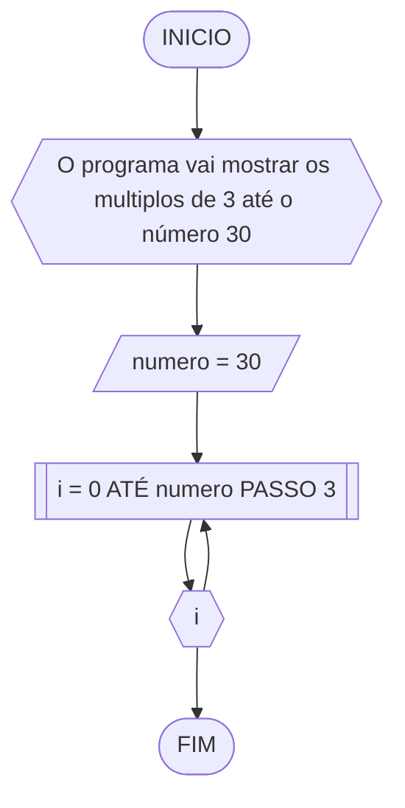
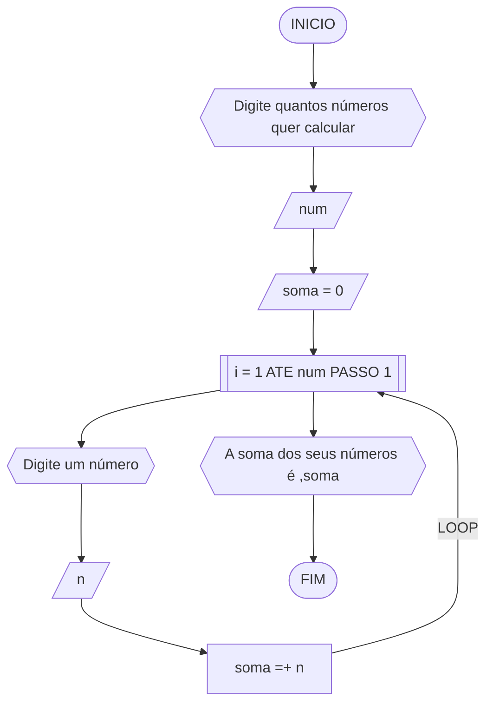
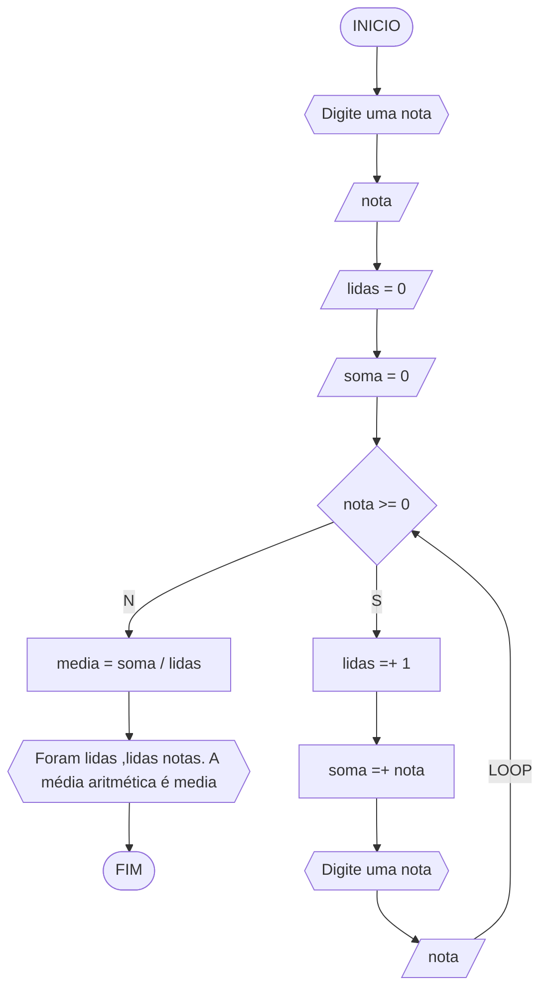

# UNIFOR
**Nome**: Lucas Gabriel Brigagão <br>
**Disciplina**: Raciocínio lógico algorítmico

### Exercício 01 (2.5 pontos)
Atualize o algoritmo para determinar se um número inteiro e positivo é par ou ímpar, usando uma laço condicional para aceitar apenas números maiores ou iguais a zero.

#### Fluxograma (1.0 ponto)


#### Pseudocódigo (1.0 ponto)
```
ALGORITMO par_ou_impar
DECLARE numero: INTEIRO
ESCREVA "Digite um número"
LEIA numero
ENQUANTO numero < 0 FAÇA
	ESCREVA "O número deve ser positivo"
	ESCREVA "Digite um número"
	LEIA numero
FIM_ENQUANTO
resto = numero % 2
SE resto = 0
ENTAO
	ESCREVA "O número é par"
SENAO
	ESCREVA "O número é impar"
FIM_SE
FIM_ALGORITMO
```

#### Teste de mesa (0.5 ponto)
| numero | numero < 0 | resto = 0 | Saída 
| -- | -- | -- | -- |
| 6 | N | S | O número é par
| 9 | N | N | O número é impar
| -1 | S |  | O número deve ser positivo

### Exercício 02 (2.5 pontos)
Faça um algoritmo que exiba na tela uma contagem de 0 até 30, exibindo apenas os múltiplos de 3.

#### Fluxograma (1.0 ponto)

#### Pseudocódigo (1.0 ponto)
```
ALGORITMO multiplo_de_três
DECLARE numero,i
numero = 30
LEIA numero
PARA i DE 0 ATÉ numero FAÇA
	ESCREVA "i"
FIM_PARA
FIM_ALGORITMO
```

#### Teste de mesa (0.5 ponto)
| i | n | Saída      
| -- | -- | --        
| 0 | 30 | 0   
| 3| 30 | 3   
| 6 | 30 | 6  
| 9 | 30 | 9
| 12 | 30 | 12
| 15 | 30 | 15
| 18 | 30 | 18
| 21 | 30 | 21
| 24 | 30 | 24
| 27 | 30 | 27
| 30 | 30 | 30       

### Exercício 03 (2.5 pontos)
Dada uma sequência de números inteiros, calcular a sua soma. 
Por exemplo, para a sequência {12, 17, 4, -6, 8, 0}, o seu programa deve escrever o número 35.

#### Fluxograma (1.0 ponto)


#### Pseudocódigo (1.0 ponto)
```
ALGORITMO seq_soma
DECLARE num,soma,i,n
ESCREVA "Digite quantois números quer calcular"
LEIA num
soma = 0
PARA i DE 1 ATE num PASSO 1
	ESCREVA "Digite um número"
	LEIA n
	soma =+ n
FIM_PARA
ESCREVA "A soma dos seu números é ,soma"
FIM_ALGORITMO
```

#### Teste de mesa (0.5 ponto)

### Exercício 04 (2.5 pontos)
Escreva um programa que leia a nota de diversos alunos, até que seja digitada uma nota negativa. 
Nesse momento, ele mostra a média aritmética de todas as notas lidas e quantas notas foram lidas. 
Ex. Foram lidas 14 notas. A média aritmética é 6.75!

#### Fluxograma (1.0 ponto)


#### Pseudocódigo (1.0 ponto)
```
ALGORITMO lidas_media
DECLARE nota,lidas,soma,media
ESCREVA "Digite uma nota"
LEIA nota
lidas = 0
soma = 0
ENQUANTO nota >= 0
	lidas =+ 1
	soma =+ nota
	ESCREVA "Digite uma nota"
	LEIA nota
FIM_ENQUANTO
media = soma / lidas
ESCREVA "Foram lidas ,lidas notas. A média aritmética é media"
FIM_ALGORITMO
```

#### Teste de mesa (0.5 ponto)

